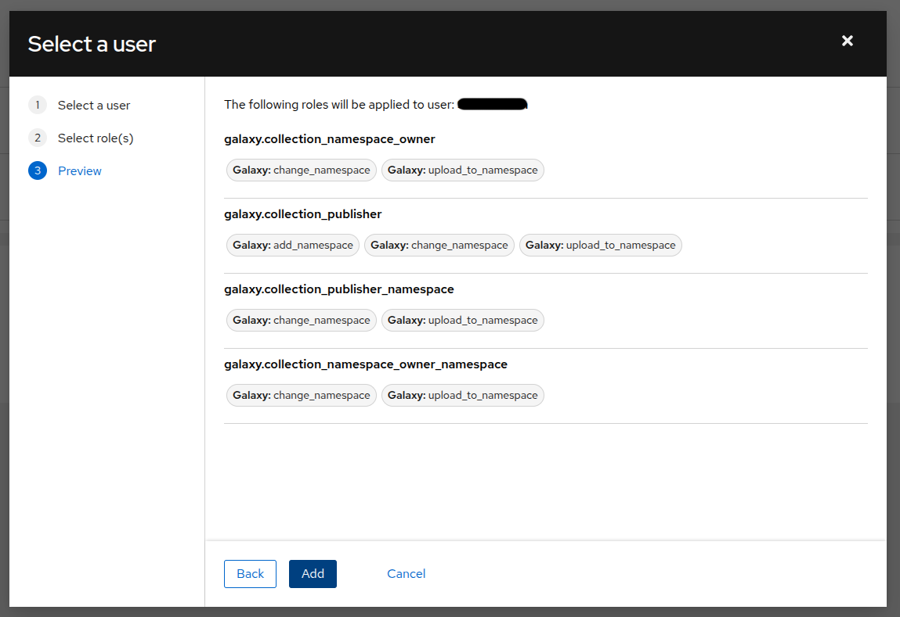

# Commonground collection for Ansible

Tools to deploy web-apps & related Common Ground components with Ansible.

## Docker-on-a-VM approach

Some of the roles in this collection contribute to installing a web-app with Docker
on a VM and exposing it to the outside world.

The relevant roles for this are:

* `django_app_docker`: role focusing on Django web-apps conforming to [default-project](https://bitbucket.org/maykinmedia/default-project). It runs the backend container(s), including Redis cache, Celery workers,
  Celery beat...

  This will bind the container ports to the host system, ready for a reverse proxy.
  
* `app_docker`: role for running a generic app with Docker. 

* `django_app_nginx`: provides the template for the NGINX reverse proxy. The template
  is inspired on maykin-deployment, and variables from `django_app_docker` are re-used
  where possible. Note that this role does NOT install or configure nginx, look into
  `nginxinc.nginx` role for that.

The architecture is so that:

1. Given a VM with Docker provisioned (OS flavour doesn't matter)
2. An isolated network is provisioned for your app
3. Which is then exposed via NGINX
4. Where SSL _can_ be disabled.

## Running tests with Molecule

In order to run the tests, you should install the python dependencies specified in `requirements/dev.txt`:

```bash
uv pip install -r ./requirements/dev.txt
```

The tests are located inside the `molecule/` folder. Molecule expects "scenarios" in this directory. To add a new scenario, use from the root folder:

```bash
molecule init scenario scenario_name
```

The tests can be run from the root folder with:

```bash
molecule test --all
```

The user running the molecule test command needs to have permissions to talk to the docker deamon, since the tests for roles like `app_db` we are using the `community.docker.docker_image` and `community.docker.docker_container` to create docker images and running containers.

Make sure that the docker REST API is also reacheable. If not, you can use to restart the docker service and make it listen also on the TCP socket:

```bash
sudo systemctl stop docker.service
sudo dockerd -H unix:///var/run/docker.sock -H tcp://127.0.0.1:2375
```

## Testing a local version of the collection

If you want to run playbooks with a modified version of the collection, you can build it as follows:

```bash
ansible-galaxy collection build -f
```
This will output the name of the file that has been produced, for example `/local/path/to/ansible-collection/maykinmedia-commonground-2.0.5.tar.gz`. Then, in the directory with your playbooks, you can run:

```bash
ansible-galaxy collection install /local/path/to/ansible-collection/maykinmedia-commonground-2.0.5.tar.gz
``` 


## Publishing to Ansible Galaxy

### Setting up a token

In order to push to Ansible Galaxy, there should be a token configured in the repository under the name `GALAXY_API_KEY`. 

In order to obtain a valid token, a user should log into Ansible Galaxy using their Github account. The user should have the `maykinmedia` namespaces under **Collections** > **Namespaces** and then **My namespaces**. If this is *not* the case, a user that is linked to the `maykinmedia` namespace can update the roles of another user:



Once linked to the `maykinmedia` namespace, the token can be downloaded under **Collections** > **API token** in the Ansible Galaxy web interface.

### Release procedure

1. Create a release branch with name `release/X.X.X` where X.X.X is the new semantic version to publish.
1. Update the `CHANGELOG.md` file.
1. Update the version field in the `galaxy.yml` file.
1. Push the branch to Github. Once CI passes and the PR is approved, merge it into `main`.
1. Check out and pull the lastest version of the main branch and then add a tag with `git tag -a X.X.X -m ":bookmark: Release X.X.X"` (the commit message can also be something else).
1. Push the tag `git push origin X.X.X`.

The Github actions will check that the version in the `galaxy.yml` matches the git tag, and if this check succeeds, the new version will be built and pushed to Galaxy. 